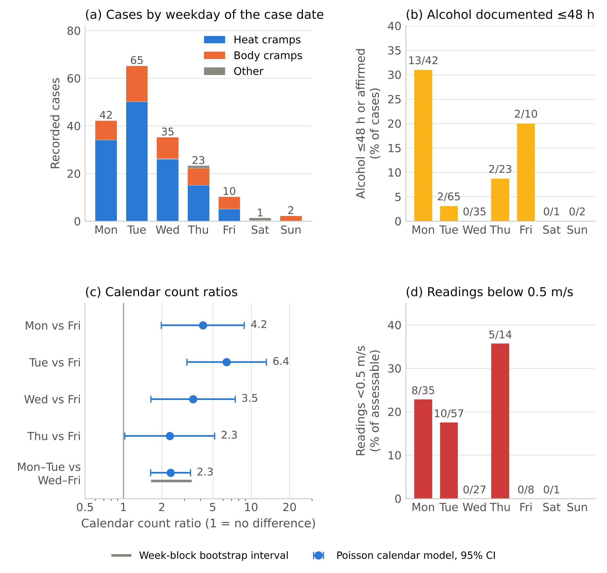
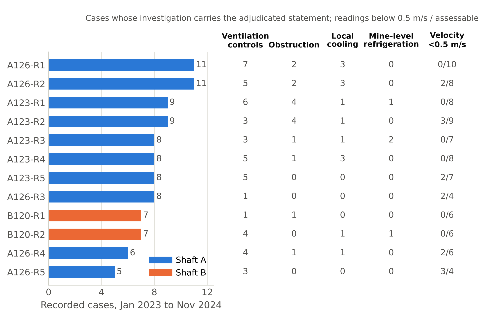
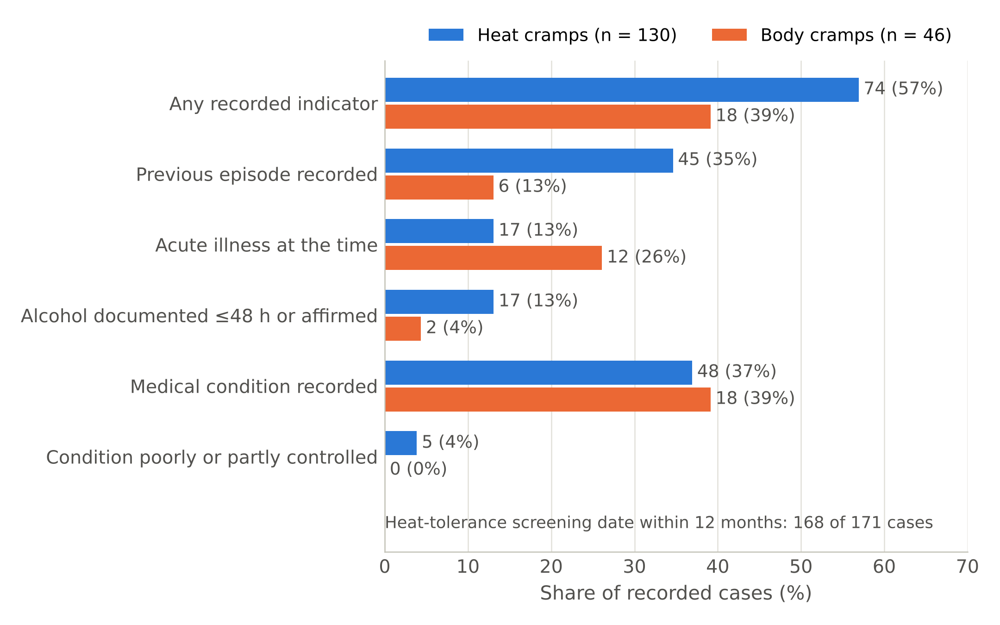
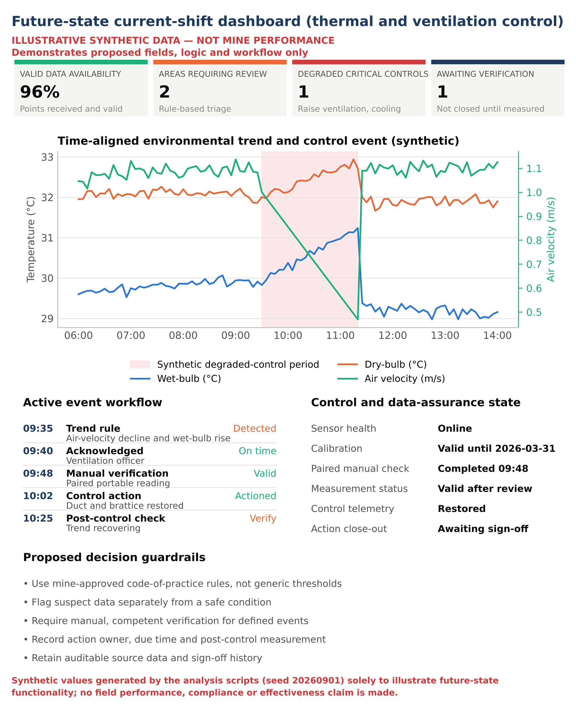

# Supplementary material

Companion to *Heat-case register analysis to inform continuous risk assessment and hybrid occupational hygiene and ventilation monitoring in a deep-level gold-mining complex* (M. Mochubele and M.I. Mabala). The paper's six figures and seven tables are listed in the repository README; this file holds the figures, tables and notes that the journal's page limit did not allow, written so that they can be read without the paper open. All counts refer to the cleaned analysis set of 178 cases (142 with a quality-valid environmental reading) unless stated otherwise.

## Figure S1 — The weekday profile

*(a) cases by weekday of the case date; (b) share of cases with alcohol use documented within approximately 48 hours or affirmed; (c) calendar count ratios from the Poisson calendar model with 95% confidence intervals and, for the grouped contrast, the week-block bootstrap interval; (d) share of assessable readings below 0.5 m/s.*

Cases concentrated at the start of the working week: Tuesday 65, Monday 42, Wednesday 35, Thursday 23, Friday ten and the weekend three. The pattern is not chance (chi-square 48.3 on 4 degrees of freedom, p < 10⁻⁹) and not season or year: in the calendar model Monday and Tuesday carried 2.3 times the Wednesday-to-Friday rate (95% CI 1.6–3.4), and the excess stayed between 1.6 and 3.4 under the quasi-Poisson and negative-binomial fits and in the week-block bootstrap (Table S1). Tuesday alone carried 6.4 times the Friday rate (3.1–13.2) and Monday 4.2 times (2.0–8.8). The case date is the date of attendance at the health centre, so part of the Tuesday count is Monday's exposure, and without attendance data the ratios compare calendar days, not exposure; neither caution removes the pattern. There was no rise after pay day (days 25–31 against other days: ratio 0.91, 95% CI 0.61–1.37).

The register offers one explanation, and it covers Monday only: recent alcohol use was documented for 13 of the 42 Monday cases against six of the 136 on other days (odds ratio 9.7, 95% CI 3.4–27.7), and for two of the 65 Tuesday cases. Restricting the class to entries with an explicit timing within 48 hours gives the same picture (10 of 42 Mondays against 3 of 136 other days; odds ratio 13.9, 3.6–53.3). The field may reflect exposure, attendance, questioning or recording practice; it is a clinical matter for fitness-for-work and not a supervisory trigger. The Tuesday peak needs roster, production and control-status data to explain. Low velocity followed the same days: eight of 35 Monday readings and ten of 57 Tuesday readings were below 0.5 m/s (Thursday's 5 of 14 rests on a small denominator), and none of 27 on Wednesdays. What follows for practice is a pre-entry routine for the first two production shifts after the weekend that checks the velocity and the controls before the crew enters.

## Figure S2 — Raise lines

*Recorded cases on the twelve most affected raise lines (coded), with the adjudicated coded investigation statements and the readings below 0.5 m/s on each.*

The place profile is the most concentrated in the register. The 123 and 126 levels of Shaft A carried 62 and 55 cases, two-thirds of the total; the 120 and 116 levels of Shaft B carried 24 and 10. Within the levels, 72 of the 156 cases assigned to a raise line fell on eight lines with eight to eleven cases each, all on the two Shaft A levels (A126-R1 and A126-R2 with 11 each; A123-R1 and A123-R2 with 9; A123-R3, A123-R4, A123-R5 and A126-R3 with 8). The panels on a raise line share the raise ventilation, the centre-gully brattices and the cooling car that serve them, and the findings recur along the line: on the two most affected lines, ventilation-control deficiencies were recorded for seven and five of the eleven cases. The counts show where an inspection starts, and that the raise line, not the shaft or the level, is the unit at which the controls are shared and the cases recur. The full table of raise lines with their coded statements, low-velocity readings and previous-episode counts is `results/main/T07b_raise_lines.csv`.

## Figure S3 — Recorded worker-context indicators by designation

*Recorded worker-context indicators by designation, as a share of the recorded cases in each designation; the previous-episode comparison uses the 40 body-cramp records with an entry.*

Ninety-three cases (52%) carried at least one recorded indicator: a previous episode for 51 (29%), an acute illness for 30 (17%), recent alcohol use documented within approximately 48 hours or affirmed for 19 (11%) and a poorly or partly controlled medical condition for five (3%); 82 cases carried one indicator, ten carried two and one carried three. The designations differ in the kind of indicator rather than in its presence: previous episodes and documented alcohol use sit in the heat-cramp records (a previous episode for 35% of heat-cramp cases against 15% of body-cramp cases with an entry; odds ratio 3.0, 95% CI 1.2–7.7, p = 0.018, q = 0.09), acute illness in the body-cramp records (26% against 13%; p = 0.06, q = 0.16). The health centre assigns the designation partly on these fields, so the contrasts describe its logic, not two kinds of case, and neither survives adjustment. A heat-tolerance screening date within twelve months was recorded for 168 of the 171 cases with a usable screening date (median interval five months; 111 within six months): screening currency was not the gap. The indicators identify the workers for whom the fitness-for-work line of defence matters most; they do not transfer responsibility from the engineering and organisational controls.

## Figure S4 — Future-state dashboard demonstrator (synthetic data)

*Current-shift dashboard generated from deterministic synthetic data (seed 20260901; the series is `figures/Figure_10_synthetic_time_series.csv`).*

The historical dashboard of the paper (Figure 6) is populated with the aggregate outputs of the analysis set and shows what the register can already deliver when it is read as a whole: case burden, environmental completeness, investigation gaps, recurrence and coded statements in one view, for retrospective learning and data-quality assurance rather than real-time status. This future-state dashboard is generated from explicitly synthetic data to illustrate the functions that the hybrid architecture (Figure 5 of the paper) adds: time-aligned environmental trends, critical-control state, data-quality status, manual verification, acknowledgement, action and post-control confirmation. It is a design demonstrator and not evidence of mine performance; neither dashboard has operational validation, and acknowledgement alone does not close an action.

## Table S1 — Statistical tests in the three primary families, with Benjamini–Hochberg q-values

| Family | Contrast | Data | Estimate | Test | p | q (BH within family) |
|---|---|---|---|---|---|---|
| Environment | Shaft A vs Shaft B: velocity <0.5 m/s | 21/109 vs 2/33 | OR 3.7 (0.8-16.7) | Fisher exact | 0.104 | 0.311 |
| Environment | Shaft A vs Shaft B: velocity <1.0 m/s | 69/109 vs 21/33 | OR 1.0 (0.4-2.2) | Fisher exact | 1 | 1 |
| Environment | Night vs day shift: velocity <0.5 m/s | 1/18 vs 12/99 | OR 0.4 (0.1-3.5) | Fisher exact | 0.688 | 0.826 |
| Environment | Night vs day shift: wet-bulb temperature | medians 31.0 vs 30.6 C | Hodges-Lehmann shift +0.3 C; rank-biserial r +0.13 | Mann-Whitney | 0.384 | 0.577 |
| Environment | Operational documentary mention (either source): readings flagged by the review screen vs not flagged | 22/26 vs 82/116 | OR 2.3 (0.7-7.1) | Fisher exact | 0.22 | 0.439 |
| Environment | Air velocity: investigation codes ventilation controls vs not | medians 0.70 vs 0.90 m/s | Hodges-Lehmann shift -0.20 m/s; rank-biserial r -0.27 | Mann-Whitney | 0.00555 | 0.0333 |
| Operational | Weekday distribution Monday-Friday vs calendar days (Friday-independent) | Mon 42, Tue 65, Wed 35, Thu 23, Fri 10 | chi-square 48.3 (4 df) | Chi-square goodness of fit | 8.15e-10 | 5.71e-09 |
| Operational | Monday-Tuesday vs Wednesday-Friday (calendar count ratio, grouped Poisson model) | RR 2.34 | 95% CI 1.63-3.35 | Poisson GLM, robust SE | 3.5e-06 | 8.18e-06 |
| Operational | Tuesday vs Friday (calendar count ratio, Poisson model) | RR 6.43 | 95% CI 3.14-13.15 | Poisson GLM, robust SE | 3.47e-07 | 1.21e-06 |
| Operational | Monday vs Friday (calendar count ratio, Poisson model) | RR 4.19 | 95% CI 1.98-8.84 | Poisson GLM, robust SE | 0.00017 | 0.000239 |
| Operational | Days 25-31 vs other days (calendar count ratio, Poisson model) | RR 0.91 | 95% CI 0.61-1.37 | Poisson GLM, robust SE | 0.661 | 0.682 |
| Operational | Alcohol <=48 h or affirmed, documented: Monday vs other days | 13/42 vs 6/136 | OR 9.7 (3.4-27.7) | Fisher exact | 1.27e-05 | 2.22e-05 |
| Operational | Alcohol <=48 h or affirmed, documented: Tuesday vs Wednesday-Sunday | 2/65 vs 4/71 | OR 0.5 (0.1-3.0) | Fisher exact | 0.682 | 0.682 |
| Worker context | Previous episode recorded: heat cramps vs body cramps | 45/130 vs 6/40 | OR 3.0 (1.2-7.7) | Fisher exact | 0.0184 | 0.092 |
| Worker context | Acute illness recorded: heat cramps vs body cramps | 17/130 vs 12/46 | OR 0.4 (0.2-1.0) | Fisher exact | 0.0621 | 0.155 |
| Worker context | Alcohol <=48 h or affirmed, documented: heat cramps vs body cramps | 17/129 vs 2/43 | OR 3.1 (0.7-14.1) | Fisher exact | 0.163 | 0.272 |
| Worker context | Medical condition recorded: heat cramps vs body cramps | 48/130 vs 18/46 | OR 0.9 (0.5-1.8) | Fisher exact | 0.86 | 0.86 |
| Worker context | Recorded worker-context indicator: readings flagged by the review screen vs not flagged | 16/26 vs 62/116 | OR 1.4 (0.6-3.3) | Fisher exact | 0.517 | 0.647 |

The heat-cramp versus body-cramp comparisons cited in the paper form a separate exploratory family (`results/main/S4a_designation_continuous.csv`, `S4b_designation_categorical.csv`); the pairwise co-occurrence of statements and factors is in `S5_cooccurrence.csv` (no pair beyond chance across 78 pairs; strongest: ventilation controls with water or wet conditions, 13 records against 6.7 expected, q = 0.09). The weekday-model robustness checks (quasi-Poisson, negative binomial, week-block bootstrap) are in `T06f_weekday_model_robustness.csv`.

## Table S2 — Case-linked environmental readings by designation, shaft and shift (quality-valid readings only)

| Group | n | Wet-bulb C median (IQR) | Dry-bulb C median (IQR) | Velocity m/s median (IQR) | Above or at the statutory limit | Velocity <0.25 m/s | Velocity <0.5 m/s | Velocity <1.0 m/s |
|---|---|---|---|---|---|---|---|---|
| All cases | 142 | 30.6 (30.0-31.5) | 32.5 (31.9-33.5) | 0.80 (0.50-1.10) | 6 | 2 | 16% (11-23%) | 63% (55-71%) |
| Heat cramps | 124 | 31.0 (30.0-31.5) | 32.5 (31.9-33.5) | 0.80 (0.50-1.10) | 5 | 1 | 15% (10-23%) | 63% (54-71%) |
| Body cramps | 16 | 30.1 (29.5-30.5) | 32.0 (31.6-32.8) | 0.80 (0.58-1.20) | 0 | 0 | 19% (7-43%) | 69% (44-86%) |
| Shaft A | 109 | 30.5 (30.0-31.4) | 32.0 (31.7-33.0) | 0.70 (0.50-1.00) | 6 | 2 | 19% (13-28%) | 63% (54-72%) |
| Shaft B | 33 | 31.0 (30.5-31.8) | 33.5 (32.3-34.0) | 0.90 (0.70-1.30) | 0 | 0 | 6% (2-20%) | 64% (47-78%) |
| Day shift | 99 | 30.6 (30.0-31.5) | 32.3 (31.6-33.5) | 0.80 (0.60-1.10) | 4 | 2 | 12% (7-20%) | 63% (53-72%) |
| Night shift | 18 | 31.0 (30.1-31.7) | 32.8 (32.0-33.5) | 1.00 (0.62-1.18) | 2 | 0 | 6% (1-26%) | 44% (25-66%) |

Shift is not recorded for 25 quality-valid readings, so the day- and night-shift rows do not sum to the total. Intervals are Wilson 95% intervals. The statutory limits are 32.5 °C wet-bulb and 37 °C dry-bulb. The six readings above or at a limit are listed in `results/main/T03c_statutory_limit_records.csv`: three above a limit (two of them the 4 January 2024 crosscut event on the 116 level of Shaft A, 37 °C wet-bulb and dry-bulb with no measurable air movement) and three exactly at a limit.

## Note S5 — A constrained machine-learning check

Because a register of this kind invites predictive claims, one was tested. A class-weighted logistic regression trained on age, the environmental readings, level, occupation group, shift, season and the pay-window indicator to predict the recorded body-cramp designation among the 140 quality-valid heat-cramp and body-cramp records achieved a mean repeated cross-validated area under the receiver-operating-characteristic curve of 0.65 (0.61 out-of-fold), little better than chance, and an area of 0.24 when trained on 2023 and tested on 2024, that is, no transportability. A shallow decision tree (0.59) and a restricted random forest (0.66) did no better. When all 177 heat-cramp and body-cramp records of the register as recorded were included with within-fold imputation, the area rose to 0.85 (balanced accuracy 0.77), but only because environmental readings are missing for 31 of 47 body-cramp records and three of 130 heat-cramp records (odds ratio 82): the model learnt the documentation pathway, not a physiological distinction. The result argues for a designation reason selected from a controlled list and the complete investigation required for every case, and against building risk models on the register as it stands. The check was run on the register as recorded; the duplicate row removed in the cleaning is a body-cramp record without readings, so it never entered the complete-case model. Outputs and diagnostics are in `ml_check/`.

## Note S6 — The statistical tools, explained for the practitioner

The register holds cases but no worker-hours, so none of the statistics in the paper is a rate or a risk. They answer a limited question — how much confidence can be placed in a count, a difference or a concentration seen in 178 cases? — and every result is presented with its estimate, its precision and its practical meaning, so that statistical and practical significance can be judged separately (Greenland et al., 2016).

**Proportions and Wilson intervals.** A share such as "16% of assessable readings were below 0.5 m/s" is reported with a 95% Wilson confidence interval (Wilson, 1927; Newcombe, 1998): the range (here 11–23%) within which the true share would be expected to lie if the register were a sample of such cases. A narrow interval means the share is well determined; a wide one, as for the small Shaft B or body-cramp groups, means the figure should be read as indicative only.

**Comparing two groups on a yes-or-no outcome.** Whether low-velocity readings were more common in Shaft A than in Shaft B is a comparison of two proportions. The Fisher exact test (Fisher, 1935) gives the probability (p) that a difference at least this large would arise by chance if the two groups were really alike, and the odds ratio with its Woolf interval (Woolf, 1955) gives the size of the difference: an odds ratio of 3.7 with an interval of 0.8 to 16.7 means the odds were about four times higher in Shaft A, but the interval includes 1 (no difference), so the difference is not established. Tables with more than two categories, such as the counts by weekday, use the chi-square test (Pearson, 1900).

**Comparing a measured quantity between groups.** Environmental readings such as air velocity are skewed (Esmen and Hammad, 1977; in this register the median velocity is 0.80 m/s against a mean of 0.93 m/s), so groups were compared with the Mann–Whitney test (Mann and Whitney, 1947), which compares whole distributions rather than means. Its result is expressed in physical units as the Hodges–Lehmann shift (Hodges and Lehmann, 1963) — the typical difference between a reading in one group and a reading in the other, for example −0.20 m/s where the investigation coded a ventilation-control deficiency — and in strength as the rank-biserial correlation (Kerby, 2014), which runs from −1 to +1.

**Daily counts and the calendar model.** To decide whether cases really peak on Mondays and Tuesdays, daily case counts were modelled with Poisson regression (McCullagh and Nelder, 1989) using standard errors that do not rely on the Poisson assumption (White, 1980), with adjustment for the year, broad seasonal change and the pay window. Because attendance is unknown, the model yields calendar count ratios (cases per calendar day on one weekday relative to another), not incidence rates. Daily counts vary more than a Poisson model assumes and the Friday reference group is small, so the ratios were checked with quasi-Poisson and negative-binomial fits (Ver Hoef and Boveng, 2007) and with a week-block bootstrap of 2 000 resampled calendar weeks (Efron and Tibshirani, 1993). These checks show whether a pattern depends on the model chosen; they do not, by themselves, show that it reflects exposure.

**Testing a cluster of cases.** When several cases came together on one level within a few days, the concentration was tested rather than assumed, because the eye finds clusters in any calendar. The Poisson probability of the observed count at the level's average daily rate is reported only as a descriptive scan value, since several overlapping windows and levels were examined (Naus, 1965). Two permutation tests, each with 20 000 random re-arrangements of the data, then asked whether the largest three-day count on the level is greater than chance would produce (Ernst, 2004). Null model A re-dated the level's cases at random across the study period while keeping the register's monthly and weekday pattern on average, and tests the concentration against a smoothed calendar. Null model B kept the actual mine-wide case dates, including the case-heavy days, and shuffled only the level to which each case was assigned, in the manner of the space–time permutation scan statistic (Kulldorff et al., 2005), and tests whether the concentration on one level exceeds what the mine-wide pattern already implies. Applying both shows whether a concentration exceeds what the calendar alone, and what a mine-wide episode alone, would produce.

**Many comparisons and q-values.** Testing many variables increases the chance of a false alarm, so each p-value is accompanied by a Benjamini–Hochberg q-value (Benjamini and Hochberg, 1995), which controls the false discovery rate within each of three primary families (environment; operations and time; worker context). A q-value of 0.03 means that, among results called significant at that level, about 3% would be expected to be false alarms. Comparisons between the heat-cramp and body-cramp designations, and the pairwise co-occurrence of statements, are a separate exploratory family, because the health centre assigns the designation partly from the same clinical fields being compared.

All analyses were run in Python 3 with pandas (McKinney, 2010), SciPy (Virtanen et al., 2020) and statsmodels (Seabold and Perktold, 2010); `code/analysis_v4.py` is the complete implementation.

## Note S7 — Deployment of the hybrid architecture

Periodic manual measurement and continuous digital sensing are complementary rather than alternative. A competent manual survey verifies location, method and control conditions, identifies damaged brattices, open doors, water and obstructions, and provides resilience during communication failures. Continuous sensing offers temporal coverage, trend detection and event history but remains vulnerable to placement issues, calibration drift, fouling, power and network interruptions and over-reliance on an apparently live system (Li and Liu, 2009; Muduli et al., 2018). Ventilation networks are actively managed: fan speeds, refrigeration duty and airflow distribution are adjusted for cost and production reasons, and simulation-based evaluation of these changes is now routine in deep-level mines (Chatterjee, 2014; Nel et al., 2018), which makes a time-aligned record of the control state at the workplace a practical possibility. The hybrid concept therefore has a specific meaning (Anderson and De Souza, 2017; Pretorius et al., 2019): continuous or high-frequency sensing where risk and workplace stability justify it; portable measurements and physical inspections captured digitally; fixed and portable devices periodically co-located for verification; time-aligned control states and operational context; clear visibility of missing or suspect data; and a competent person accountable for interpretation and sign-off.

Deployment is risk- and context-dependent. Stable high-risk activity areas, which in this register are the recurrent raise lines of the two most affected Shaft A levels, justify continuous fixed sensing with scheduled co-located manual measurement. Dynamic or short-life workings are better served by portable, digitally logged measurements and relocatable sensors. Event investigation combines the preceding digital history with immediate portable measurement and inspection. A sensor or network outage activates a documented manual fallback rather than a silent coverage gap. Formal reporting uses only validated and signed-off measurements. Field evaluation of the architecture — paired manual–digital agreement, valid-data uptime, detection-to-action intervals, verified restoration, and the capture of non-case shifts and worker-hours — is the subject of the second paper.

## Note S8 — What the data cleaning changed

The register as recorded (179 rows, nothing corrected) was analysed in the same way as the analysis set. The cleaning removed one duplicate row (two rows with identical structured fields and different complaint wording) and corrected four dates from the register's own fields: two case dates that lay 275 days from their diagnosis dates, among rows of a different month, were set to the month of the diagnosis date on the recorded weekday (31 January to 31 October 2023, and 10 January to 10 October 2024), and two diagnosis dates, one with the day and month transposed and one with a three-digit year, were read as intended. Six recorded weekdays that disagree with the case date were left as recorded, the case date being the better-kept field. The corrections are inferred from the register, not verified against the source case files, and each is logged with its register row in the restricted cleaning record held by the mine.

| Result | Analysis set (cleaned, n = 178) | Register as recorded (n = 179) |
|---|---|---|
| Cases 2023 / 2024 | 84 / 94 | 84 / 95 |
| Monthly cases 2023-01 | 5 | 6 |
| Monthly cases 2023-10 | 8 | 7 |
| Monthly cases 2024-01 | 8 | 9 |
| Monthly cases 2024-07 | 12 | 13 |
| Monthly cases 2024-10 | 9 | 8 |
| Cases on Monday | 42 | 42 |
| Cases on Tuesday | 65 | 65 |
| Cases on Wednesday | 35 | 37 |
| Cases on Thursday | 23 | 22 |
| Body cramps (n) | 46 | 47 |
| Quality-valid environmental readings | 142 | 142 |
| Velocity <0.5 m/s among quality-valid readings | 23/142 = 16% (95% CI 11-23%) | 23/142 = 16% (95% CI 11-23%) |
| Same-level short-window concentrations (>=3 cases in 3 days) | A-123 13 May 2024 to 14 May 2024 (3); A-123 09 Sep 2024 to 11 Sep 2024 (7); A-123 11 Nov 2024 to 12 Nov 2024 (5); A-126 30 Oct 2023 to 02 Nov 2023 (5) | A-123 13 May 2024 to 14 May 2024 (3); A-123 09 Sep 2024 to 11 Sep 2024 (7); A-123 11 Nov 2024 to 12 Nov 2024 (5); A-126 30 Oct 2023 to 02 Nov 2023 (4); A-126 10 Jan 2024 to 11 Jan 2024 (3) |
| Previous episode recorded | 51 | 51 |
| Acute illness recorded | 30 | 31 |
| Season x designation (supplementary S4, exploratory) | Cramer's V 0.21, p = 0.0474 | Cramer's V 0.26, p = 0.0077 |
| Monday-Tuesday vs Wednesday-Friday calendar count ratio | 2.34 (1.63-3.35) | 2.31 (1.60-3.33) |
| Tuesday vs Friday calendar count ratio | 6.43 (3.14-13.15) | 6.43 (3.15-13.11) |
| A-123 largest 3-day count: P under null A / null B | 0.0037 / 0.0338 | 0.0046 / 0.0328 |

The conclusions are the same with and without the cleaning; the cleaned register is used throughout the paper because it is the more accurate record.
